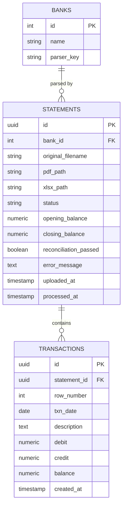
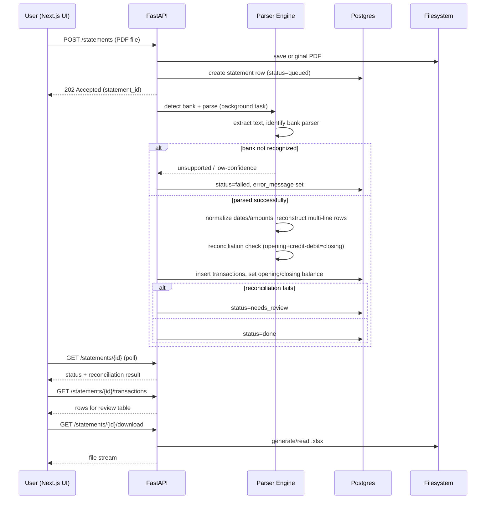

# Bank Statement PDF-to-Excel Parser — Architecture Document

**Status:** Draft v1.0
**Related:** [requirements.md](./requirements.md)
**Last updated:** 2026-07-20

---

## 1. Overview

This document defines the technical architecture for the tool described in
[requirements.md](./requirements.md): a local-only application that parses text-based bank
statement PDFs and produces a fixed-format Excel file of transactions.

Stack:

- **Frontend:** Next.js — file upload UI, bank selection, processing status, review/download.
- **Backend:** Python + FastAPI — PDF parsing engine, validation, Excel generation, REST API.
- **Database:** PostgreSQL — stores statement metadata, extracted transactions, and
  processing status.
- **Storage:** local filesystem — original PDFs and generated Excel files, referenced by
  path from the database.
- **Deployment:** local-only, via `docker-compose` on the user's own machine. No cloud
  hosting, no external network calls — matches NFR-2 (offline/local processing, privacy)
  from the requirements doc.

Since this is single-user and local-only, the architecture deliberately skips concerns that
wouldn't earn their complexity here: multi-tenant auth, horizontal scaling, message queues,
and object storage. It should still be *modular enough* that a new bank parser or a new
storage backend can be swapped in without touching unrelated code (NFR-4).

---

## 2. High-Level Architecture

```mermaid
flowchart LR
    subgraph Browser
        UI[Next.js UI]
    end

    subgraph Backend["FastAPI Backend (Docker container)"]
        API[REST API]
        Parser[Parsing Engine\n(bank-specific parsers)]
        XlsxGen[Excel Generator]
    end

    DB[(PostgreSQL)]
    FS[(Local filesystem\nuploads/ + outputs/)]

    UI -- "HTTP (upload PDF, poll status, download xlsx)" --> API
    API --> Parser
    Parser --> XlsxGen
    API -- "metadata, transactions" --> DB
    API -- "read/write files" --> FS
```

All three services (frontend, backend, db) run as containers on `localhost` via
`docker-compose`; nothing is exposed beyond the host machine.

---

## 3. Components

### 3.1 Frontend — Next.js

Responsibilities:

- File upload (single or multiple PDFs), drag-and-drop.
- Bank selection: auto-suggested from detection result, with a manual override dropdown if
  detection is ambiguous or the user wants to force a specific parser.
- Processing status view (per file): queued → parsing → validated / needs-review → done /
  failed, with the reconciliation check result (FR-16) surfaced clearly.
- Review screen: preview extracted transactions in a table before download, so the user can
  visually confirm correctness (supports NFR-1 — accuracy over blind automation).
- Download of the generated Excel file(s).
- History view: list of previously processed statements (pulled from DB), with re-download.

This is a thin client — no parsing logic lives here. It only calls the backend API and
renders what it returns.

### 3.2 Backend — FastAPI

Responsibilities:

- REST API for upload, status polling, transaction review/edit (if the user corrects a
  misparsed row before export), and file download.
- **Parsing engine**: one parser module per supported bank, behind a common interface, plus
  a bank-detection step that inspects PDF text to identify which parser to use.
- **Validation layer**: reconciliation check (opening + credits − debits = closing),
  per FR-16.
- **Excel generator**: takes normalized transaction records and writes the fixed-schema
  `.xlsx` file (openpyxl or similar), setting real date/number types (FR-15).
- Persistence: writes statement + transaction records to Postgres, writes files to the
  local `uploads/` / `outputs/` directories.

#### Parser architecture (extensibility — NFR-4)

```
backend/
  parsers/
    base.py          # BankStatementParser interface (abstract)
    registry.py       # maps detected bank -> parser class
    hdfc/
      parser.py       # e.g. HDFCParser(BankStatementParser)
      detect.py       # bank-specific detection signature
    icici/
      parser.py
      detect.py
    ...
```

- `BankStatementParser` defines the contract every bank parser implements:
  `detect(pdf_text) -> confidence score`, `parse(pdf) -> list[Transaction]`,
  `get_opening_closing_balance(pdf) -> (Decimal, Decimal)`.
- Adding a new bank = adding a new folder/module implementing this interface and
  registering it — it should not require changes to existing parsers, the API layer, or the
  Excel generator (FR-5, NFR-4).
- Detection step runs each registered parser's `detect()` against the uploaded PDF text and
  picks the highest-confidence match above a threshold; below threshold, the API returns an
  "unsupported/ambiguous — please select bank manually" response (FR-2, FR-4) instead of
  guessing.

### 3.3 Database — PostgreSQL

Stores metadata and structured transaction data — not file binaries (per your choice: files
live on disk, DB stores paths). Schema in §4.

### 3.4 File storage — local filesystem

```
data/
  uploads/<statement_id>/<original_filename>.pdf
  outputs/<statement_id>/<generated_filename>.xlsx
```

Mounted as a Docker volume so files persist across container restarts. Paths are stored in
the `statements` table.

---

## 4. Database Schema



Notes:

- `statements.status`: `queued | parsing | needs_review | done | failed`.
- `reconciliation_passed` + `error_message` surface FR-16/FR-17 directly to the UI.
- `transactions.row_number` preserves original statement order (for exact Excel row
  reproduction, FR-12).
- If the user edits a transaction on the review screen before export, that updates the row
  in `transactions` and regenerates the `.xlsx` — the DB is the source of truth, the Excel
  file is a generated artifact, not the other way around.

---

## 5. API Design (REST)

| Method | Path | Purpose |
|---|---|---|
| `POST` | `/statements` | Upload one or more PDFs; creates `statements` rows, kicks off parsing |
| `GET` | `/statements` | List processed/in-progress statements (history view) |
| `GET` | `/statements/{id}` | Status + metadata for one statement |
| `GET` | `/statements/{id}/transactions` | Extracted transactions, for the review table |
| `PATCH` | `/statements/{id}/transactions/{txn_id}` | Manual correction of a single row |
| `POST` | `/statements/{id}/reprocess` | Re-run parsing (e.g. after selecting a different bank manually) |
| `GET` | `/statements/{id}/download` | Download the generated `.xlsx` |
| `GET` | `/banks` | List supported banks (for the manual-selection dropdown) |

Given low volume and single-user scope, parsing runs synchronously within the request/
background-task of FastAPI (`BackgroundTasks`) rather than needing a separate job queue —
the frontend polls `GET /statements/{id}` for status until `done`/`failed`/`needs_review`.

---

## 6. Processing Flow



---

## 7. Deployment

`docker-compose.yml` with three services, all bound to `localhost` only:

```yaml
services:
  frontend:
    build: ./frontend        # Next.js
    ports: ["3000:3000"]
    depends_on: [backend]

  backend:
    build: ./backend         # FastAPI
    ports: ["8000:8000"]
    volumes:
      - ./data:/app/data     # uploads/ + outputs/
    depends_on: [db]
    environment:
      - DATABASE_URL=postgresql://...@db:5432/statements

  db:
    image: postgres:16
    volumes:
      - pgdata:/var/lib/postgresql/data
    environment:
      - POSTGRES_DB=statements

volumes:
  pgdata:
```

- No ports exposed beyond `localhost`; no external network dependency at runtime — satisfies
  the "fully offline/local" requirement.
- `./data` is a bind-mounted volume so PDFs/Excel files survive container rebuilds and are
  directly inspectable on the host if needed.
- Single `docker-compose up` should be the entire setup step for the user (NFR-3, usability).

---

## 8. Repository Structure (proposed)

```
pdf_statement_parser/
  docs/
    requirements.md
    architecture.md
  frontend/           # Next.js app
  backend/
    app/
      main.py          # FastAPI app entrypoint
      api/             # route handlers
      models/          # SQLAlchemy models
      schemas/         # pydantic request/response schemas
      parsers/          # bank-specific parser modules (§3.2)
      excel/           # Excel generation logic
      db/               # session/engine setup, migrations (alembic)
    tests/
      fixtures/         # sample statement PDFs per bank (redacted)
  data/                # gitignored — uploads/ + outputs/, runtime only
  docker-compose.yml
```

---

## 9. Error Handling & Validation (mapping to requirements)

| Requirement | Architectural mechanism |
|---|---|
| FR-3 (scanned PDF rejection) | Detection step checks for extractable text layer before attempting any parser; if empty/near-empty, statement is marked `failed` with a specific message. |
| FR-4 (unsupported bank) | Detection confidence below threshold → `failed`, error names that no parser matched; UI offers manual bank selection + reprocess. |
| FR-16/17 (reconciliation, partial failures) | `reconciliation_passed` boolean + `error_message` column drive a `needs_review` status shown distinctly in the UI, never silently merged into `done`. |
| FR-18 (no silent partial success) | Status model has no "partial success" state that looks like success — it's either `done` (fully validated) or `needs_review`/`failed` (flagged). |

---

## 10. Non-Functional Notes

- **Privacy/offline (NFR-2):** All processing and storage stays inside the docker-compose
  stack on the user's machine; no third-party API calls in the parsing path.
- **Performance (NFR-5):** Synchronous/background-task processing is sufficient at this
  volume (single user, monthly statements); no need for Celery/queue infrastructure in v1.
- **Extensibility (NFR-4):** New bank support = new parser module + registry entry;
  frontend, API, DB schema, and Excel generator are all bank-agnostic.
- **Data integrity:** Postgres is the source of truth for transaction data; the `.xlsx` file
  is a derived artifact that can always be regenerated from DB rows (important if the user
  edits a row via `PATCH` after initial parsing).

---

## 11. Open Items

1. **Auth:** even for local-only single-user use, confirm whether the app needs any login
   at all, or can remain unauthenticated on `localhost` (recommended: none, for v1).
2. **Migrations:** confirm Alembic (standard for FastAPI + SQLAlchemy + Postgres) for schema
   migrations as parser/schema evolves.
3. **Manual correction UX:** how much inline editing (§5, `PATCH .../transactions/{id}`) is
   actually wanted for v1 vs. just flag-and-reprocess.
4. **Retention:** whether old uploaded PDFs/outputs in `data/` should ever be auto-cleaned,
   or kept indefinitely (currently assumed: kept indefinitely, it's local disk, user's data).
